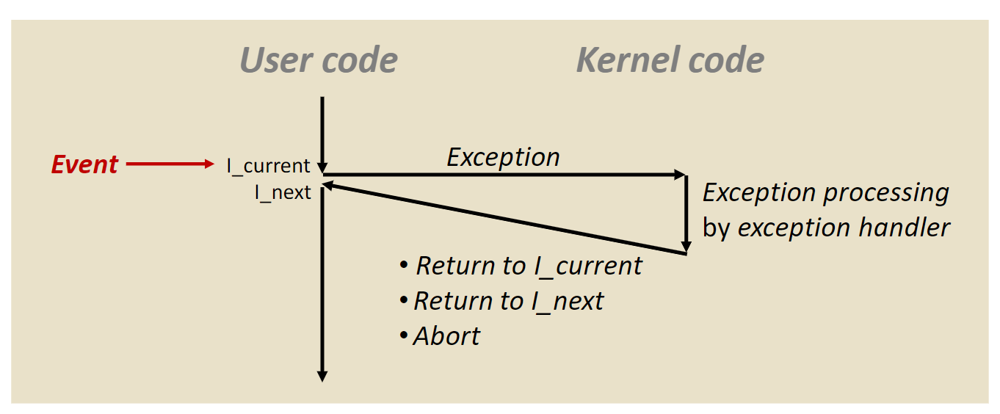

# 异常控制流

## 控制流

在计算机运行的过程中，处理器做一件事，取指令执行，取指令执行……

但是在实际运行过程中，我们总需要改变程序的控制流来实现不同的功能，我们已经介绍了两种：

- `jump`指令
- `call`和`ret`指令

我们把这两种改变都称为**程序状态**的改变。但是在实际中，我们需要对**系统状态**也做出反应，比如网络端口收到了数据包，键盘有了输入，计算机执行了错误的指令。为了解决这个问题，异常控制流就出现了。

## 异常控制流

> 异常控制流几乎存在于计算机的所有抽象层次上

低级机制：

- 对系统事件的响应：通过硬件和操作系统结合来实现

高级机制：

- 进程上下文的切换：通过操作系统和硬件计时器实现
- 信号：操作系统实现
- 非逻辑跳转：`setjump`和`longjump`，C语言运行时库实现。

## 异常

异常就是将控制流传送给操作系统内核来处理一系列的事件。操作系统内核是常驻于内存中的程序，事件可能是除数为0，算数指令溢出，`I/O`请求完成，键盘输入。



由于系统中出现的异常可能是多种多样的，处理这些异常也就需要多段代码。为了根据异常找到指定的处理程序，我们就需要一张类。似于`switch`跳转表的**异常表**。每一种类型的错误都有一种独特的编号`k`，这就是跳转表中的索引编号，这个`k`有时也被称作**终端向量**。

异常有着分类。


### 异步异常

在CPU的中断引脚上引发的异常，在处理完之后，控制流“原路”返回。

例如：

- 计时器中断
- 外围`I/O`设备引发的终端

### 同步异常

通过执行一个指令而引发的异常。

- 陷阱(Traps)：
  - 内部引发的异常
  - 例如：系统调用，断点，特殊指令
  - 控制原路返回
- 错误(faults)：
  - 不是内部引发但是多半是可恢复的
  - 例如：页错误，保护错误，空指针错误
  - 要么重新执行以尝试修正或者终止运行
- 终止(abort)：
  - 非内部引发且不可恢复
  - 例如：非法指令，
  - 终止当前程序

### 系统调用

对于一个`x86-64`的系统来说，每一种系统调用都有一个特定的编号：

| 编号 | 名称   | 描述                   |
| ---- | ------ | ---------------------- |
| 0    | read   | Read file              |
| 1    | write  | Write file             |
| 2    | open   | Open file              |
| 3    | close  | Close file             |
| 4    | stat   | Get info about file    |
| 57   | fork   | Create Process         |
| 59   | execve | Execute a program      |
| 60   | _exit  | Terminate process      |
| 62   | kill   | Send signal to process |

我们描述一种系统调用的例子——打开文件：

现有如下的汇编代码，实现打开文件的操作：`open(filename, options)`

```nasm
00000000000e5d70<_open>:
...
e5d79:   b8 02 00 00 00     mov  $0x2,%eax # open is syscall #2
e5d7e:   0f 05                     syscall# Return value in %rax
e5d80:   48 3d 01 f0 ff ff   cmp  $0xfffffffffffff001,%rax
```

在这段代码中就使用了`syscall`这个玩意儿。

- `%rax`寄存器中存储着系统调用的编号
- `%rdi`, `%rsi`等寄存器存储着参数
- `%rax`存储返回值，负返回值往往意味着异常

我们不难发现，系统调用和函数调用几乎是一致的，都有着控制的改变，使用相同的寄存器来存储参数和返回值。不过和一般的函数调用还是有着以下几个区别：

- 系统调用是由系统内核执行的，代码执行的特权是不相同的
- 系统的编号，我们不妨认为就是函数的地址，储存在`%rax`中

