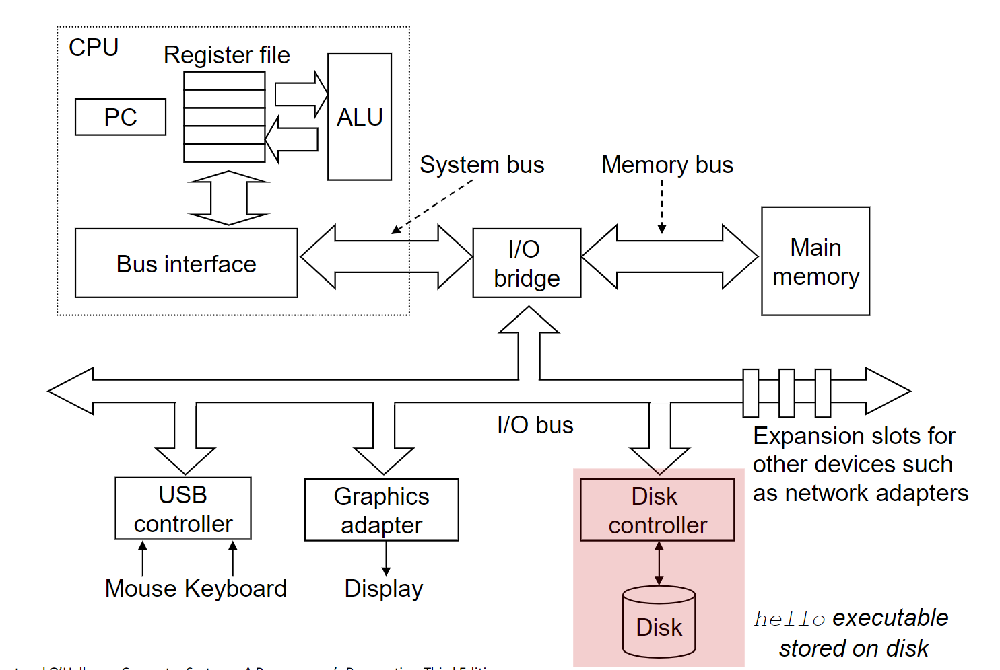
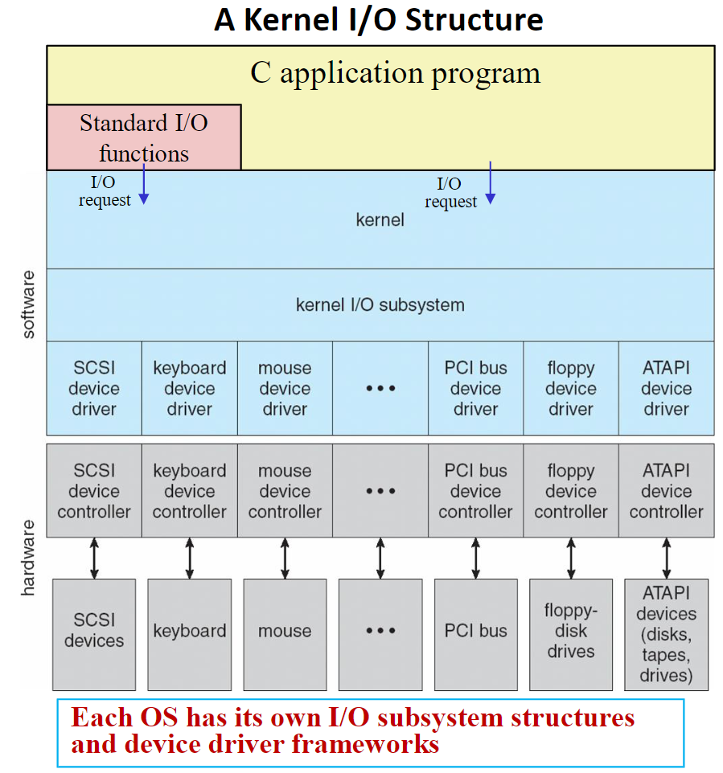
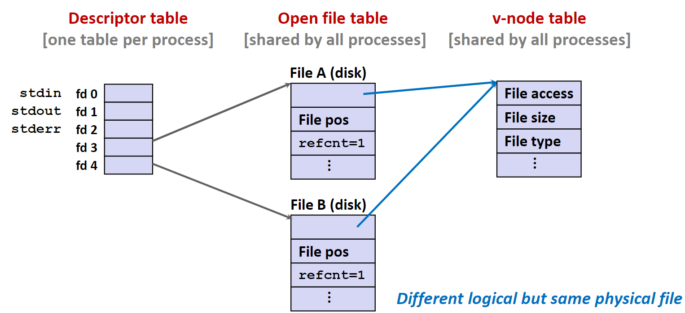

# IO

## IO系统

计算机的主要任务就是处理数据，因此如果让大量的数据快速有序的进出计算机就成为了一个考题，在计算机中这个部分就被称作`I/O`。设计一个计算机的`I/O`部分主要存在这样几个挑战：

- 可能和计算机交互的`I/O`设备种类繁多，而且各有各的特点：存储设备、网络、键盘、屏幕
- 计算机需要支持大量的设备
- `I/O`设备的驱动程序都以内核模式在系统中工作，如果出现错误就可能引发系统崩溃

因此，现在`I/O`部分已经成为了操作系统的一个重要组成部分：

- 不同的端口、总线、设备控制器连接了各式各样的外接设备
- 驱动程序隐藏了调用设备的详细细节，将操作系统提供了一套统一的调用接口。

### I/O 硬件

硬件的种类总是十分多样的：

- 存储设备
- 数据传输
- 人机接口部分

在硬件中有着一些共同的概念：

- 端口`port`：硬件和计算机连接的位置
- 总线`bus`：将设备连接向计算机的菊花链或者是公用的直连线
- 设备控制器`controller`：控制端口，总线和硬件的电子设备
  - 可能是计算机内部集成的，或者是一块独立的电路
  - 可能包含处理器，微码，私有的内存空间，总线控制器等等
  - 对于操作系统来说，控制器也隐藏了自己硬件中的细节，给系统提供了一种统一的设备接口



I/O在控制过程中是类似于计算机的：

- I/O指令用来控制设备，类似于汇编代码
- I/O设备也有着寄存器存储输入输出设备的数据，指令和设备当前的状态
- I/O设备也有着地址：
  - 被直接I/O指令使用
  - 或者有的设备会将输入输出的指令和当前状态直接映射在设备的内存中，这种方式在数据量比较大的设备中比较常用，比如显卡。

设备驱动程序在I/O控制过程中：

- 驱动程序向提供了一套统一的设备调用方法，隐藏了调用不同设备之间的细节
- 驱动程序设计者需要对设备的设计细节十分的了解
- 驱动程序需要运行在内存模式才有特权去调用I/O指令

I/O设备的调用一般有着下面三种方式：

- 轮询调用

  系统将反复读取设备的状态，通过寄存器之类的方法来确定设备的当前运行状态。当设备出现问题时，系统将耗费大量的资源。

- 中断调用

  设备通过一个硬件中断引脚通知CPU，CPU在每条指令处理完毕之后都会检测这个引脚的状态，如果中断到达就会调用对应的中断处理程序来处理

- DMA直接内存读取

  设备可以绕过CPU，直接从其他的设备或者内存中读取数据进行处理。

下面这张图详细给出了计算机系统中从应用程序到底层硬件中的复杂关系



> 需要注意的是，不同的操作系统可能有着不同的I/O架构设计

## Unix I/O & C Standard I/O

Unix I/O和C标准库中的I/O操作是两个不同层级的I/O，一个是系统级别的I/O，一个是C语言的运行时库，是对前者的一个封装。

### Unix I/O

- 在Unix系统之下，一个文件就是一个字节序列
- 在Unix系统中，系统将每一个I/O设备都映射成系统中的一个文件

> 这就是Unix系统设计哲学之一：文件即系统

再将所有的设备映射为一个文件之后，Unix系统就通过几个简单的操作实现了Unix I/O：

- 打开和关闭文件：`open`和`close`函数
- 读取和写入文件：`write`和`read`函数
- 改变当前读取文件的位置：`lseek`函数

### 文件的类型

每个文件都有一个特定的类型来标识他在系统中的类型：

- 文件
- 目录
- 套接字（Socket）

在系统还有一些其他的文件类型，不过在本文中我们不做讨论：

- Named Pipelines 
- Symbolic links
- Character and block devices

#### 文件

一个不同的文件中可以包含任意的数据。

应用程序会区分文本文件和二进制文件：

- 文本文件往往只包含ASCII字符或者是Unicode字符
- 二进制文件是除了文本文件之外的所有文件
- 注意：系统是不会在这两者之间做区分的

文本文件往往是由一系列的文本行组成的，每一个文本行都是用一个EOL去终结的。在不同的系统上可能有着不同的行终止符：

- Unix:LF
- Windows: CRLF

#### 目录

目录中包含一系列的连接，将一个文件名指向一个文件。

每个目录中都至少包含两个连接：

- `.`指向其本身的连接
- `..`指向一个父目录的连接

Unix系统提供了一系列的命令来控制目录

- `mkdir`创建一个目录
- `ls`查看目录中的内容
- `rmdir`删除一个目录

可以通过`/`将一系列目录名连接在一起，标识一个绝对或者相对的路径。

- 在Unix系统中`/`标识根文件系统，从`/`开始的文件路径为绝对路径
- 从`.`开始的文件路径为相对路径

> 操作系统会为每个程序维持一个当前的运行目录（CWD）

### 文件操作

#### 打开文件

打开文件就是通知系统你已经准备好获取这个文件中的内容了。

```c
int fd;

if (fd = open("/etc/hosts", O_RDONLY) < 0 )
{
	perror("open");
	exit(1)
}
```

`open`函数的返回值是一个被称为文件描述符的整数，我们就通过这个整数来访问我们想要访问的文件。如果文件描述符小于0，往往意味着发生了错误。

每个通过Linux Shell创建的进程都会有三个文件文件描述符和这个Shell联系起来：

- 0: standard input
- 1: standard output
- 2: standard error

#### 关闭文件

关闭文件就是通知操作系统你已经完成了对这个文件的操作。

```c
int fd; // 之前通过open拿到的文件描述符
int returnVal;

if ((returnVal = close(fd)) < 0)
{
	perror("close");
	exit(1)
}
```

注意在关闭文件的时候，也需要检查关闭函数的返回是否是正常的。重复的关闭一个文件可能会导致灾难性的后果。

> 即使是如同`close`一样看上去人畜无害的函数也需要检查返回值。

#### 读取文件

读取一个文件从当前文件的位置复制一系列的字节到内存中，然后更新文件的位置。

```c
char buf[512];
int fd; // 前文中通过open获得的文件描述符
int nbytes;

if ((nbytes = read(fd, buf, sizeof(buf))) < 0 )
{
    perror("read");
    exit(1);
}
```

读取文件函数的返回值是从文件中读取字符的数量。

- 返回值是一个有符号的整数
- 这个返回值小于0说明在读取过程中发生了错误
- 不足值`nbytes < sizeof(buf)`并不意味着错误，只是文件中的内容不足以填满空间而已

#### 写入文件

写入文件意味着从内存中复制一系列的字符到当前的文件位置中，然后在更新文件的位置。

```c
x char buf[512];
int fd; // 前文中通过open获得的文件描述符
int nbytes;
if ((nbytes = write(fd, buf, sizeof(buf))) < 0 )
{    
	perror("write");    
	exit(1);
}
```

和`read`函数一样，小于0的返回值意味着错误，不足值不表示错误。

> 虽然这里的不足值不表示错误显得有点反直觉，下文中有解释。

#### 不足值

不足值可能在下面这些场景中出现：

- 在读取的过程中遇到了EOF
- 从终端中读取文件
- 在读取和写入网络套接字

不足值不可能在下面这些情形中出现：

- 从磁盘中的文件读取（除非遇到了EOF）
- 向磁盘中的文件写入

> 在一般情况下，我们都是允许不足值的出现。

## 元数据 & 文件共享 & 重定向

### 元数据

元数据就是关于数据的数据。

操作系统维护者每个文件的元数据，可以利用`stat`和`fstat`这两个函数来访问文件的元数据。在内核中，元数据的定义是下面这个结构体：

```c
/* Metadata returned by the stat and fstat functions */
struct stat 
{
	dev_t	st_dev;      /* Device */
    ino_t 	st_ino;      /* inode */
    mode_t	st_mode;     /* Protection and file type */
    nlink_t	st_nlink;    /* Number of hard links */
    uid_t	st_uid;      /* User ID of owner */
    gid_t	st_gid;      /* Group ID of owner */
    dev_t	st_rdev;     /* Device type (if inodedevice) */
    off_t	st_size;     /* Total size, in bytes */
    unsigned long st_blksize;  /* Block size for filesystemI/O */
    unsigned long st_blocks;   /* Number of blocks allocated */
    time_t	st_atime;    /* Time of last access */
    time_t	st_mtime;    /* Time of last modification */
    time_t	st_ctime;    /* Time of last change */
};
```

###  Linux如何打开文件

两个不同的文件描述符将指向两个不同的文件。


#### 文件共享

两个不同的文件描述符可以通过两个独立的文件打开表实例共享相同的磁盘文件。



#### 创建进程

父进程可以通过调用`fork`函数创建一个新的子进程。

- `fork`函数将给子进程返回0，给父进程返回子进程的`PID`
- 子进程几乎和父进程一模一样：
  - 子进程将得到一份父进程虚拟内存空间的拷贝，虽然完全独立
  - 子进程也会得到父进程文件描述符的拷贝
  - 子进程将有着和父进程不同的PID

> 注意：`fork`函数常常令我们困惑，因为这个函数会返回两次，分别在子进程的父进程。

### I/O 重定向

> Shell 中实现管道和重定向的原理

通过调用`dup2(oldFd, newFd)`函数就可以改变文件描述符指向的文件。

## 标准I/O 函数

在C语言的标准库中包含着一系列高级的标准I/O函数。

### 标准I/O流

C语言库会通过一种**流**的方式打开文件，这是C语言标准库对于内核中文件描述符和内存中缓存的一个抽象。

在每个C语言程序开始运行的时候，C都会自动初始化三个打开的流：

- `stdio`标准输入流
- `stdout`标准输出流
- `stderr`标准错误流

这三个流通过全局变量的方式定义在`stdio.h`这个头文件中。

C语言中实现流这种抽象的主要结构体是`FILE`：

```c
typedef struct __iobuf {
	int cnt;       /* characters left */
    char *ptr;      /* next characters position */
    char *base;     /* location of buffers */
    int flag;      /* mode of file access */
    int fd;        /* file descripter*/
} FILE;
```

> C语言这样抽象文件描述符的原因是：
>
> - 程序中常常只会一个字一个字的读取文件
> - 然而每次系统调用都是较为耗时的，因为涉及到内核态和用户态的切换
>
> 所以采用这样一种缓存的方式提高文件读写的效率

既然我们已经拥有了两个不同层面的I/O访问方法，那我们应该如何选择使用哪种API呢？

首先来看看两种方式的优缺点：

Unix I/O:

- 优点 ：
  - 是最通用、最底层的API，所有的其他I/O都是这个API的一个高层抽象
  - 提供了获得文件元信息的方法
  - 异步安全，可以用于信号处理程序中
- 缺点：
  - 不足值的处理比较困难的
  - 读取大量的文本需要使用缓冲来提高效率

C标准库I/O:

- 优点：
  - 使用缓冲降低了使用系统调用的数量，提高了效率
  - 不足值会被自动的处理
- 缺点：
  - 没有提高访问元数据的函数
  - 不是异步安全的，不适合在信号处理程序中使用
  - 不适合读写网络套接字

在了解两种API的差异之后，我们就可以大体上给出一些原则：

- 第一，永远使用你能使用的最高级API
- 第二，在信号处理程序和需要极端性能时，再使用底层API

